# CineTicket

###Consumers Cinematic Seat Companion
- Streamlined ticket booking with movie and cinema selection, seating arrangement developed using Kotlin
- Utilizes Firebase Realtime Database, Authentication, Cloud Storage for seamless data management, security.
- Utilizes MVVM architecture for a well-structured and maintainable codebase
- It includes booking history of user. 

## Screenshots

| Login | Register | Forgot Pass | Home | Navigation | Buzz |  
| --- | --- | --- | --- | --- | --- |
| 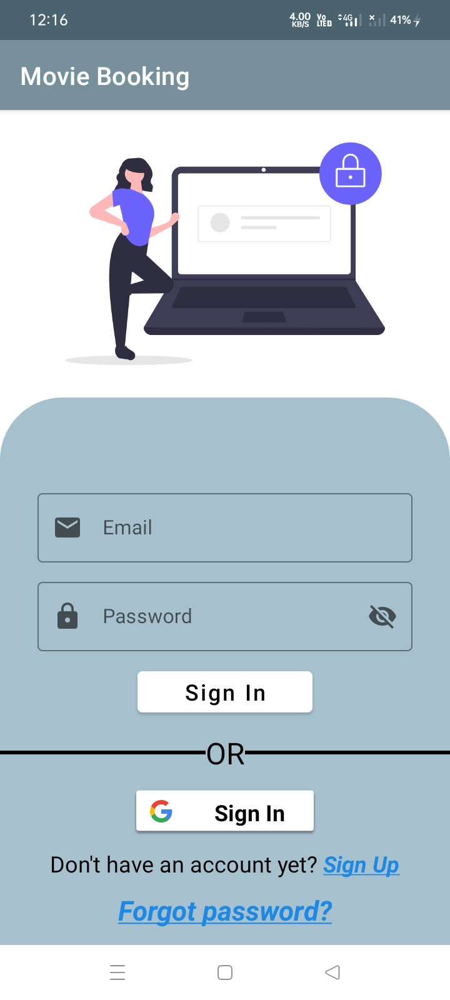 | 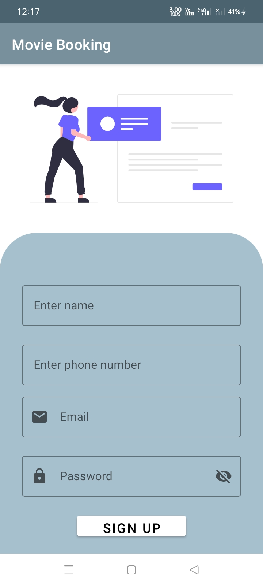 | 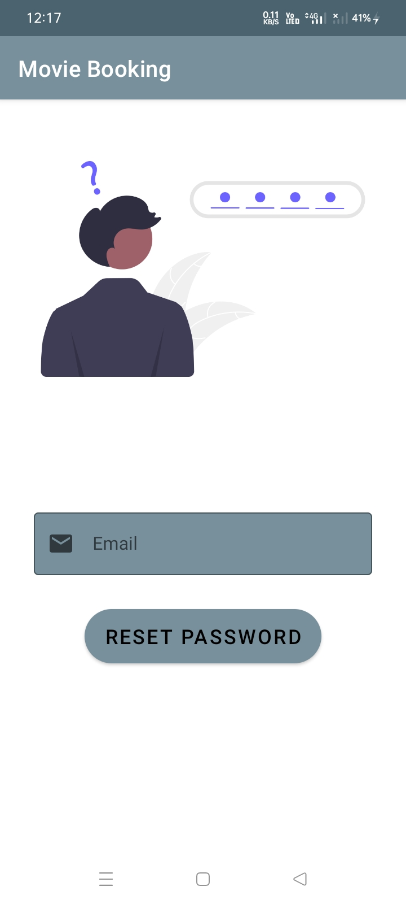 |  | 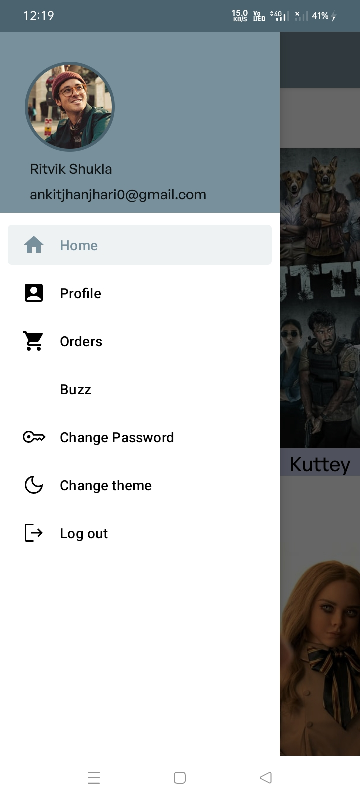 | 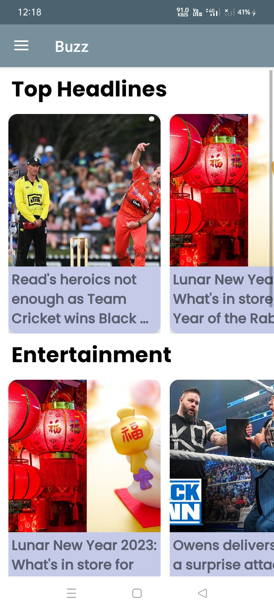 |

| Movie Details | cinemas | Seating 1 | Seating 2 | Profile | No of Tickets |  
| --- | --- | --- | --- | --- | --- |
| 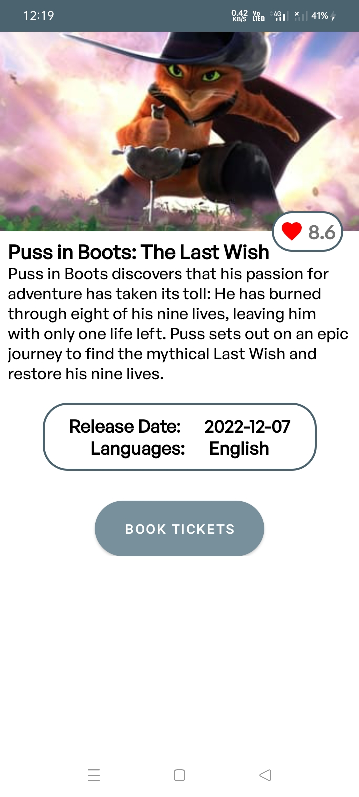 | 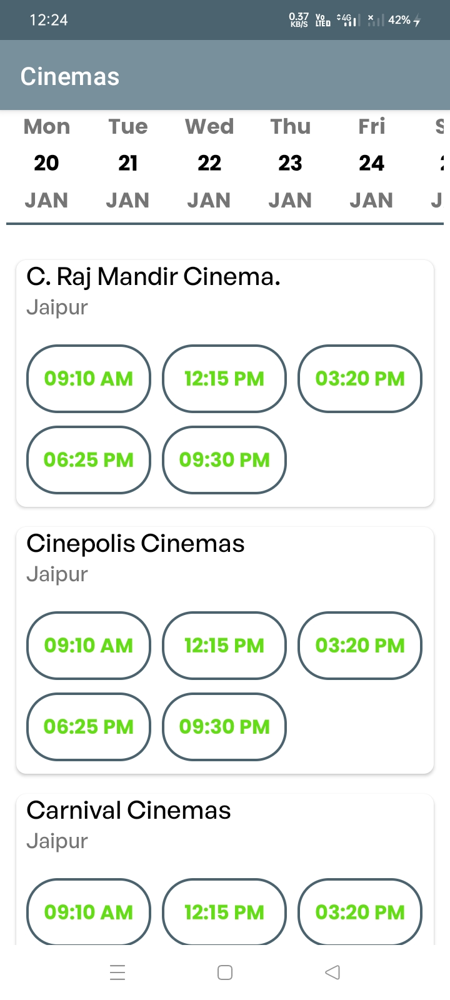 | 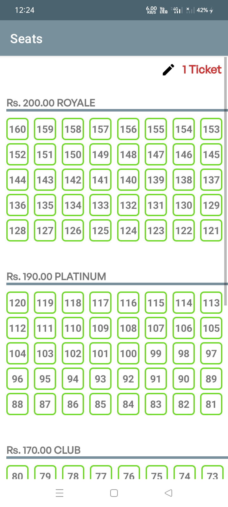 | 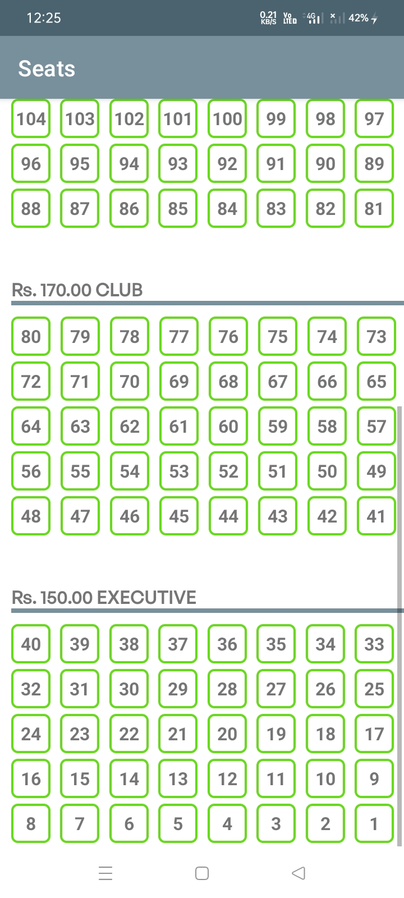 | 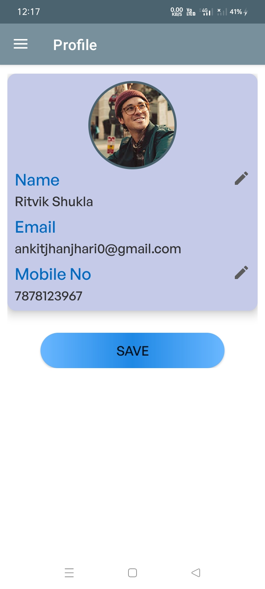 | 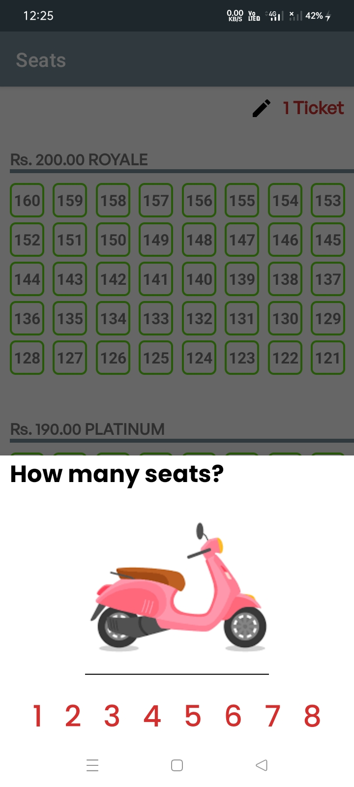 |
