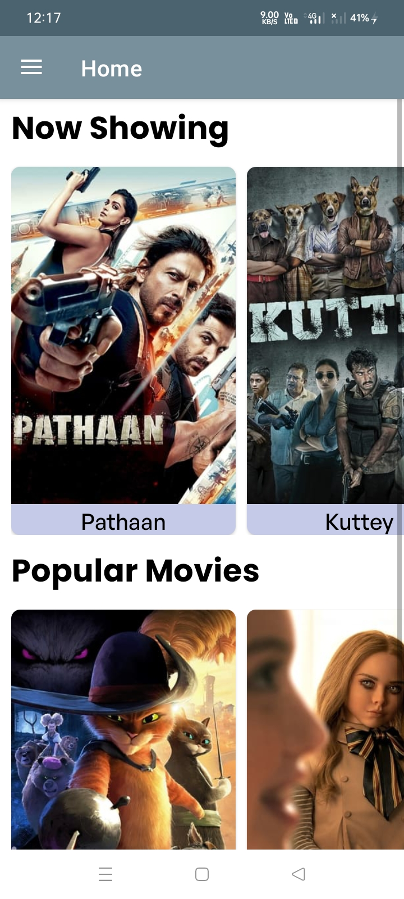

# Movie-Ticket-Booking

- This is Online Movie Ticket Booking App like clone of BookMyShow made using Kotlin.
- Select movie and cinema from list.
- Seating arrangement and Payment Gateway.
- It includes booking history of user.
- It uses Firebase Realtime database, Authentication, Cloud Storage
- It uses libraries as Firebase, Navigation Component, Retrofit, GSON Converter, picasso etc.

## Screenshots

  
## Currently under development !!
